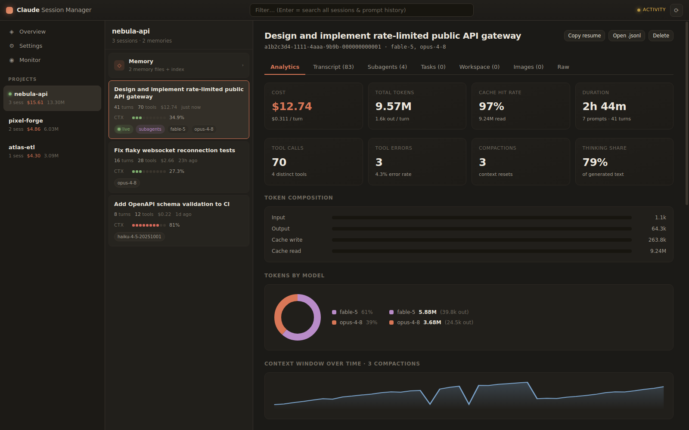
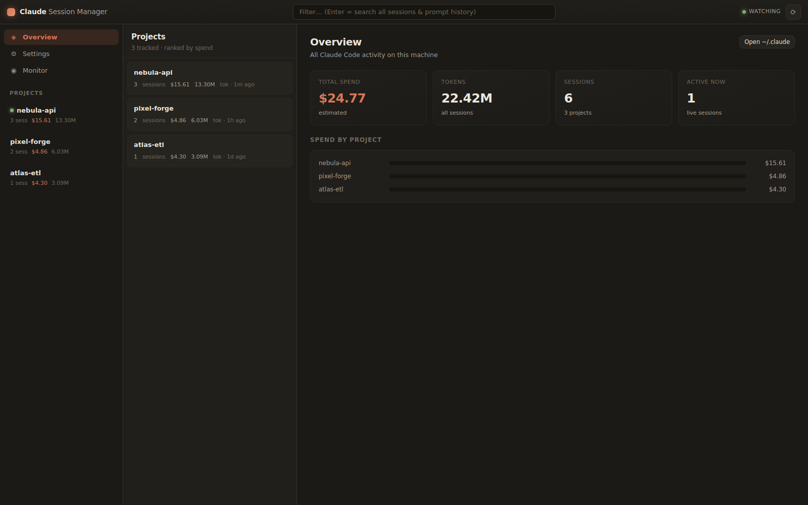
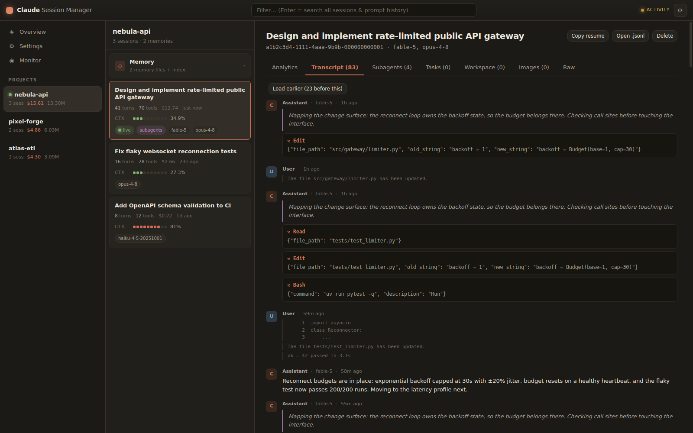
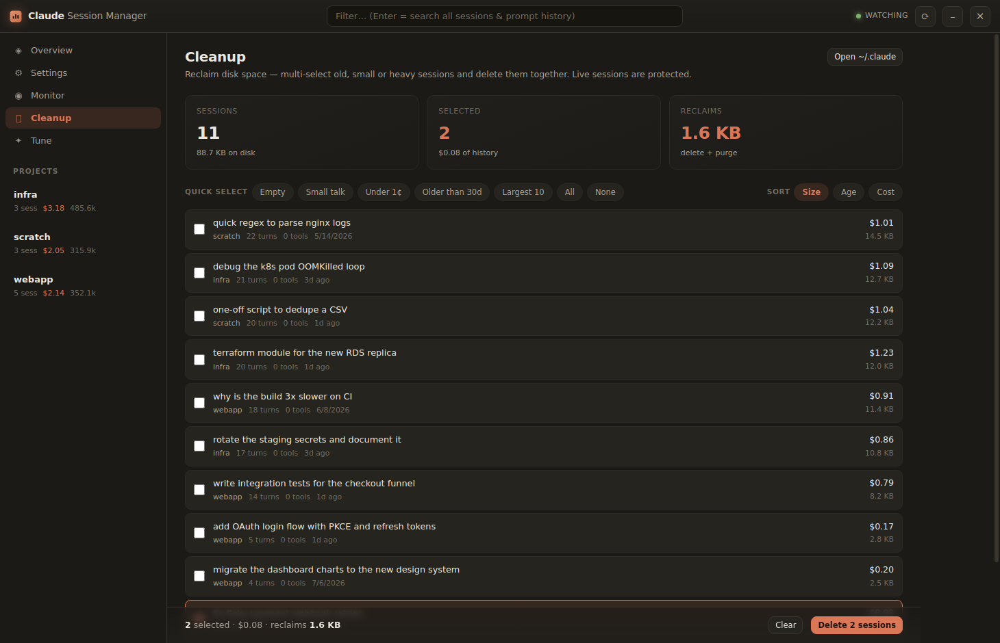
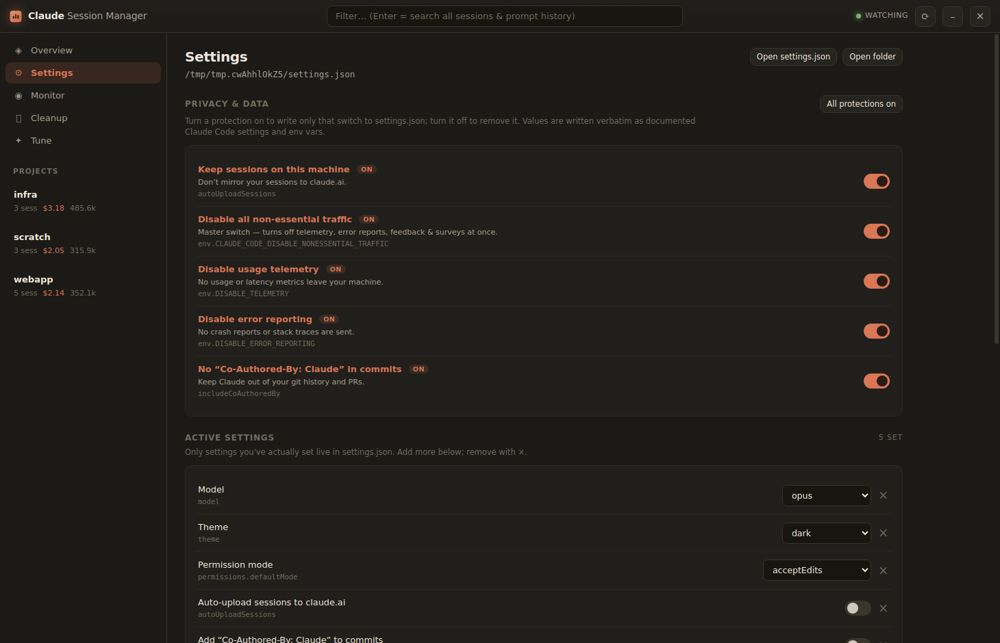

<p align="center"></p>

# Claude Session Manager

> **Unofficial community tool** — not affiliated with, or endorsed by, Anthropic.
> "Claude" is a trademark of Anthropic, PBC. This app only reads files that
> Claude Code stores on your own machine.

A modern, fast desktop app for exploring everything **Claude Code** stores on your
machine — sessions, memory, subagents, scratchpads, tasks, images, shells,
settings and live state — all grouped by project and richly visualized. Built
with **PySide6** + **QtWebEngine** (an HTML/CSS/JS frontend for a beautiful,
extensible UI) and managed with **uv**. Cross-platform: Linux and Windows.



| Overview | Transcript |
|---|---|
|  |  |
| **Cleanup** | **Privacy-first settings** |
|  |  |

*(Screenshots show generated demo data.)*

**Fast by design:** `orjson` parsing (a cold 10 MB transcript summarizes in
~40 ms), disk-cached summaries keyed by mtime+size, and *incremental* parsing —
while a session is live, only the newly appended bytes are read (~0.1 ms per
refresh), never the whole file. Transcripts are **paged**: the backend serves a
small window of messages and loads earlier pages on demand, so even a 100 MB
session opens instantly on every tab; live sessions append only newly written
events. Statusline ticks are routed on a cheap path that never triggers a
rescan.

Docs: [CHANGELOG](CHANGELOG.md) · [CONTRIBUTING](CONTRIBUTING.md) ·
[LICENSE](LICENSE) · [vendor/NOTICE](vendor/NOTICE)

## What it shows

- **Projects** — every project Claude Code has touched, ranked by spend, with live
  activity indicators.
- **Sessions** — per-session transcript viewer (user / assistant / thinking / tool
  calls / results), reconstructed from the `.jsonl` transcripts.
- **Analytics** — cost, token composition (input / output / cache read / write),
  spend by model, context-window-over-time and cumulative-cost sparklines, and
  tool-usage breakdowns. Cost is computed from real usage with a built-in,
  editable model price table; assistant usage is de-duplicated by `message.id`.
- **Context meters** — the statusline-style 10-slot meter, reconstructed per
  session from token usage (`input + cache_read + cache_write` ÷ context window).
- **Subagents** — sidechain messages and `Agent`/`Task` invocations.
- **Memory** — the project `memory/` store (MEMORY.md index + individual memory
  files with frontmatter), with in-app **edit / save / delete**.
- **Scratchpads** — the per-session scratchpad tree, with previews.
- **Tasks** — the per-session task board.
- **Cleanup** — reclaim disk space: every session on the machine with its full
  on-disk footprint, multi-selected by hand or with one-tap presets (empty, small
  talk, under 1¢, older than 30 days, largest 10) and deleted in bulk. Live
  sessions are protected.
- **Tune** — drive your own signed-in `claude` CLI over your history to **refine
  a CLAUDE.md** (global or per-project) or **consolidate sessions into memory
  notes**. Runs headless and async; only session summaries are sent, never full
  transcripts.
- **Settings** — a comprehensive, catalog-driven editor: a **Privacy & data**
  section with one-tap privacy-first defaults (keep sessions off claude.ai, kill
  non-essential traffic, disable telemetry / error reporting), a dedicated
  **environment-variable** editor, and arbitrary custom keys — all writing
  straight to `settings.json`. Only settings you actually set are written;
  removing one prunes it, so the file never accumulates dead keys.
- **Live monitor** — active sessions and context pressure, updated live via a
  filesystem watcher.
- **Live statusline capture** (opt-in) — rate limits (5h / 7d) and live context %
  are only handed to your statusline command by Claude Code and aren't stored on
  disk. An optional, removable one-line hook lets the app read the latest values.
- **Global search** — press Enter in the search box to search every session
  (titles, first prompts) *and* your full prompt history, with jump-to-session.
- **Image gallery** — pasted images from the session image cache, as thumbnails.
- **Workspace** — the per-session scratchpad *and* background-task outputs.
- **Shells & environments** — shell snapshots and session-env dirs in Monitor.
- **Settings as controls** — toggles and dropdowns writing straight to
  `settings.json`, plus an in-app editor for small config files
  (`statusline-command.sh`, `settings.json`, commands, agents…).
- **Copy resume** — one click copies `claude --resume <session-id>`.

Buttons throughout open paths in **VS Code** or your file manager, and sessions /
memory can be **deleted** (with confirmation).

## Where the data lives

| What | Path |
|---|---|
| Config home | `~/.claude` (or `%USERPROFILE%\.claude`, or `$CLAUDE_CONFIG_DIR`) |
| Sessions | `~/.claude/projects/<encoded-path>/<session>.jsonl` |
| Memory | `~/.claude/projects/<encoded-path>/memory/` |
| Tasks | `~/.claude/tasks/<session>/*.json` |
| Scratchpads | `<tmp>/claude-<uid>/<encoded-path>/<session>/scratchpad/` |
| Settings | `~/.claude/settings.json`, `settings.local.json` |
| Statusline | `~/.claude/statusline-command.sh` |

## Run

```bash
uv sync
uv run csm
```

or `uv run python -m csm.app`.

## Build a standalone executable

```bash
uv sync --extra build
uv run pyinstaller --noconfirm ClaudeSessionManager.spec
```

This produces a **single-file** `dist/ClaudeSessionManager` executable — no
`_internal` folder beside it. On Windows it carries the app icon and shows a
splash screen while it unpacks on first launch. PyInstaller cannot
cross-compile, so run the build on the OS you're targeting (on Windows via
`powershell.exe` + a Windows `uv` when working from WSL).

## Architecture

```
csm/
  paths.py            cross-platform Claude path resolution
  pricing.py          model price table + cost math
  session_parser.py   streaming .jsonl parser (summary + detail)
  scanner.py          enumerate projects/sessions/memory/tasks/scratchpad/settings (cached)
  watcher.py          watchdog → Qt signals (live updates)
  actions.py          delete / bulk-delete / save / settings / statusline hook
  assistant.py        headless `claude` CLI prompts + output parsing (Tune)
  bridge.py           QWebChannel object exposed to JS
  app.py              QApplication + QWebEngineView shell
web/
  index.html styles.css app.js   the frontend
```

Nothing is sent anywhere — the app only reads and (on explicit action) writes your
local Claude directory.
